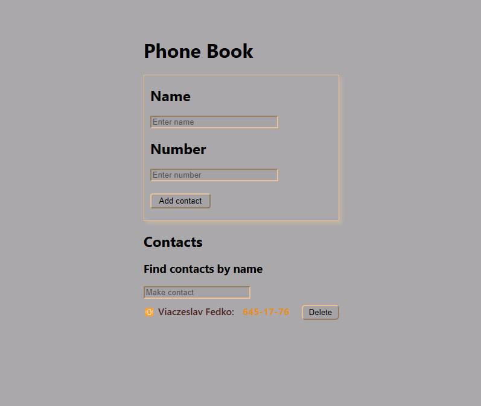

# Phonebook

https://viache-slav.github.io/goit-react-hw-07-phonebook/ - link to the working page in github

This project was created as a react.js homework assignment from GOIT school

This project is a contact book with the ability to add, filter and delete previously saved records using local storage.

Refactoring the 'Phonebook' application code with the addition of state management using the Redux Toolkit library.

To run the project on your hardware: 
   - you need to clone this repository https://github.com/Viache-Slav/goit-react-hw-07-phonebook.git
   - run the installation with the command `npm install`
   - start the project with the command `npm start`

## screenshot
